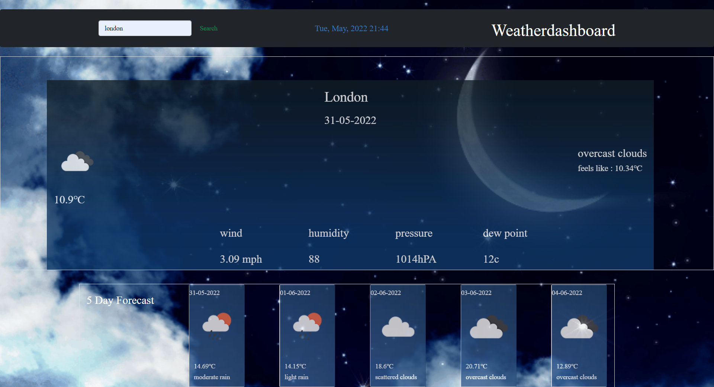

# weather-dashboard

## user journey and purpose of app

- i designed this application so that people could see current and future weather conditions for any city so they could
  plan ahead for holidays, journeys or trips in advance without being taken by suprise by unprecedented weather conditions.

## what i was tasked to do:

- create a weather dashboard with form inputs
- WHEN the user searches for a city Then they presented with current and future conditions for that city
- WHEN the user views current weather conditions for that city then it is added to the search history
- WHEN the user views current weather conditions for that city Then they are presented with the city name, the date, an icon representation of weather conditions, the temperature, the humidity, the wind speed, and the UV index
- Then after the user is presented with a background and icon which shows what type of weather is to be expected
- the user can also have a look at future weather conditions for that city with a 5 day forecast which displays the weather condition temperature etc;

## My links

-github url: [https://github.com/abdinasir1993/weather-dashboard](https://github.com/abdinasir1993/weather-dashboard)

-deployed url:[https://abdinasir1993.github.io/weather-dashboard/](https://abdinasir1993.github.io/weather-dashboard/)

### desktop Viewports

